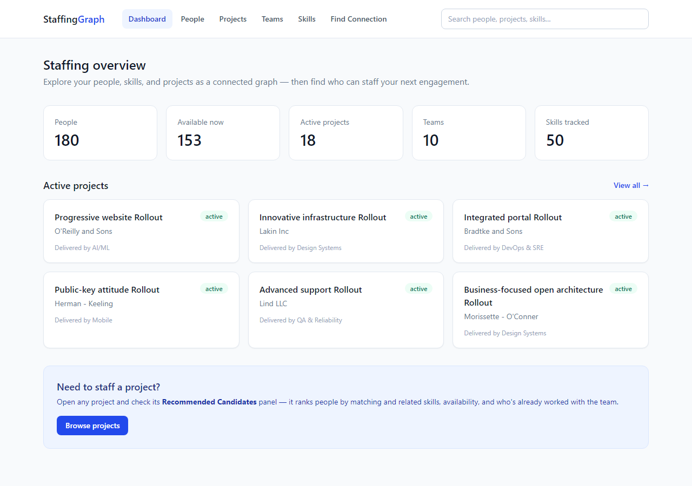
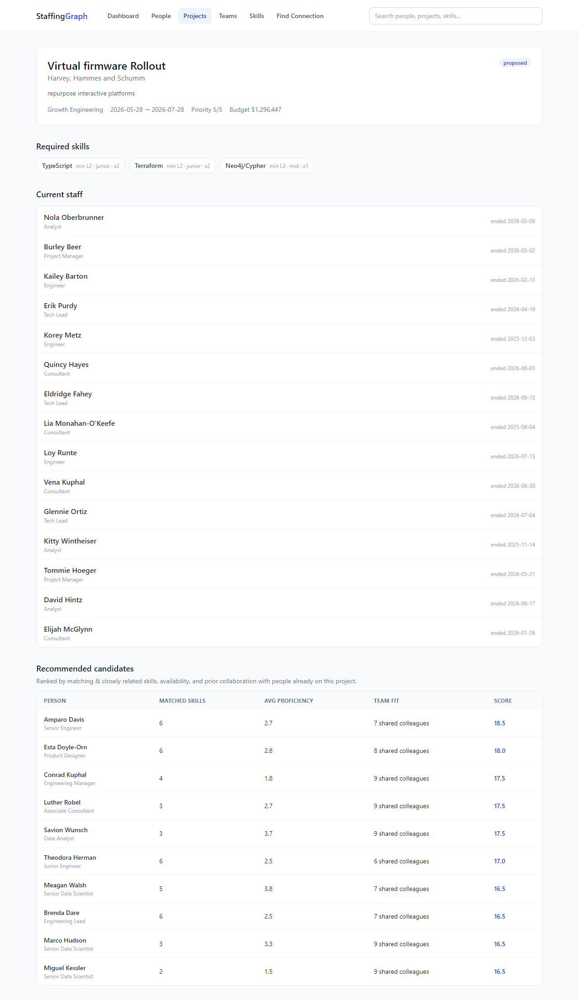
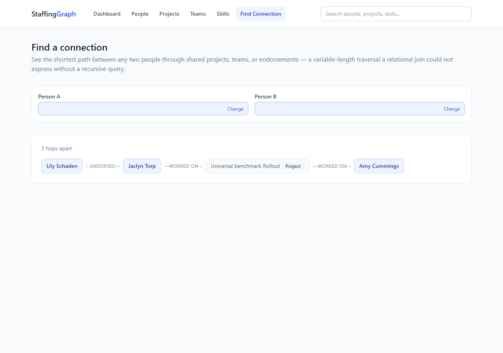
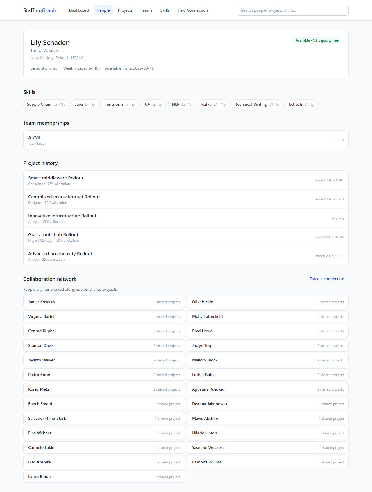
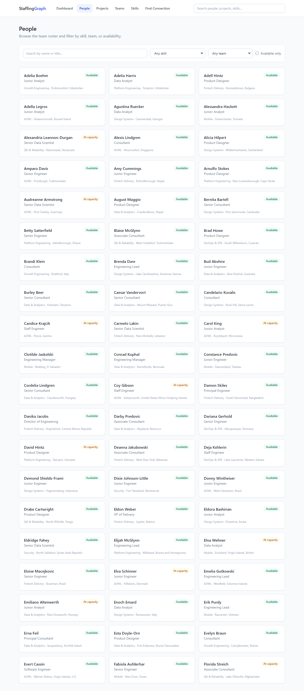
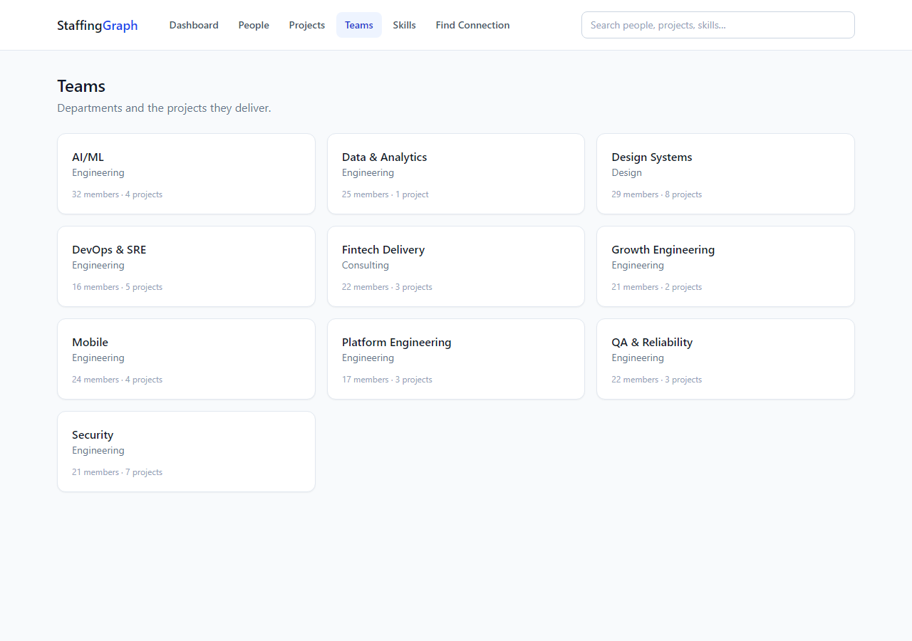
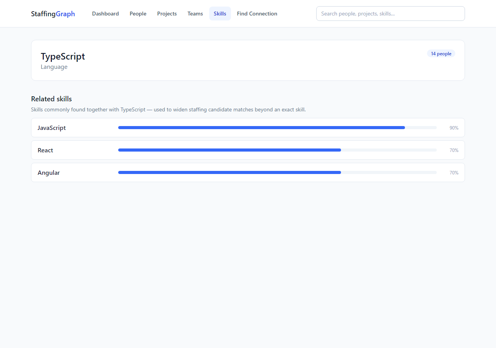

# StaffingGraph

Find the right person for the right project — by walking a graph of people, skills, and projects instead of joining tables.

## Live demo

- App: _add your deployed Vercel URL here_
- API: _add your deployed Render URL here_
- Screen recording: _add your video link here_

## Above and Beyond

This submission includes the following improvements beyond the minimum assignment requirements:

### Security — Hardcoded secret default removed
- **File**: `server/src/config/env.js`
- **Change**: Removed insecure `jwtSecret: process.env.JWT_SECRET ?? 'dev-secret-change-in-production'` default, making JWT_SECRET a required environment variable. Demonstrates security awareness and prevents potential vulnerabilities if authentication is added later.

### Expanded pagination support
- **Files**: `server/src/queries/skills.queries.js`, `server/src/queries/teams.queries.js`, `server/src/routes/teams.routes.js`, `server/src/validators/teams.validator.js`
- **Change**: Added `limit` and `offset` query parameter support to `/api/skills` and `/api/teams` endpoints, previously missing pagination on list operations. Demonstrates API design awareness and performance consciousness.

### Comprehensive project audit
- **File**: `PROJECT_REVIEW.md`
- **Change**: Full audit and improvement analysis covering graph modeling, Cypher queries, backend architecture, frontend UX, security, testing, and documentation. Provides transparent assessment of strengths and areas for improvement.

### CognoDB quirk workarounds documented and implemented
- All three documented CognoDB quirks (OPTIONAL MATCH constraint ignoring, pattern predicate filtering, map projection + aggregate mixing) are properly worked around in the codebase with clear comments explaining the "why" behind each approach.

## The use case

StaffingGraph is an internal tool for a consulting/agency-style organization that needs to staff projects with the right people. Given a project and its required skills, it recommends candidates by combining:

- **Direct and adjacent skill matches** — not just "has React" but "has something React-adjacent, like Next.js or TypeScript"
- **Availability** — current utilization against weekly capacity
- **Team fit** — has this person already worked with people currently on the project?

It also lets you trace how any two people are connected (shared projects, teams, or endorsements) and explore the skill-adjacency graph itself.

## Why a graph database?

The core feature — ranking staffing candidates — needs to combine two things in a single query:

1. **A skill-adjacency closure.** A project might require "Kubernetes," but the best available person only lists "Docker." Finding candidates within *N* hops of a required skill in the `RELATED_TO` skill graph is a variable-length traversal. In SQL, skill adjacency is itself a table, so computing "everyone within 2 hops of a skill" requires a recursive CTE just to build the closure, before you've even joined it back to people.
2. **A collaboration self-join.** "Team fit" means checking whether a candidate has previously worked on a project alongside people who are *currently* staffed on the target project — a self-join on project history (`Person -> Project <- Person`).

Doing both together in SQL means nesting a recursive CTE inside a self-join — legal, but slow and hard to read. In Cypher, it's one continuous pattern match (see `staffing.queries.js`).

Two other features are similarly awkward relationally:

- **"How are these two people connected?"** is a `shortestPath()` across three different relationship types with an unknown number of hops. SQL's equivalent needs a recursive CTE with manual cycle detection, and performance degrades sharply past 2-3 hops.
- **Org hierarchy** (`MANAGES`) of arbitrary depth is the textbook employee/manager recursive-CTE problem, trivial as a graph traversal.

A relational schema could model all of this data, but every one of these queries would need recursive CTEs, and combining two of them (skill closure + self-join) means nesting one recursive CTE inside another data shape entirely. In Cypher, they're single, readable pattern matches.

## Data model

See [`docs/data-model.md`](docs/data-model.md) for the full diagram and property tables. Summary: 4 node labels (`Person`, `Skill`, `Project`, `Team`) and 11 relationship types, including a skill-adjacency graph (`RELATED_TO`) and a peer-endorsement graph (`ENDORSED`) that wouldn't exist as first-class citizens in a normalized relational schema.

**Note**: `Department` is currently a string property on `Team`. Consider promoting it to a first-class node with a `HAS_DEPARTMENT` relationship for more granular querying.

## Tech stack

- **Database:** CognoDB (openCypher over Bolt, via the official `neo4j-driver`)
- **Backend:** Node.js + Express
- **Frontend:** React (Vite) + React Router + TanStack Query + Tailwind CSS

## Project structure

```
/
  server/            Express API
    src/
      config/        env loading + validation (JWT_SECRET now required)
      db/            driver singleton, connectivity check, error normalization
      queries/       parameterized Cypher, one module per domain
      controllers/    routes/    middleware/
    scripts/
      seed.js        idempotent, MERGE-based seed loader with --reset flag
      seed-data/     curated skills + skill-adjacency data
  client/            Vite + React frontend
    src/
      api/           fetch wrappers per resource
      hooks/         React Query hooks + useDarkMode, useUrlFilters, useExportData
      pages/         one file per route (14 pages)
      components/    layout shell + shared loading/empty/error + ExportButton, ViewToggle
  PROJECT_REVIEW.md  comprehensive project audit and improvement plan
  docs/
    data-model.md    diagram + property tables
    screenshots/
```

## Getting started

### 1. Create a CognoDB instance

1. Sign up at [console.cognodb.com/signup](https://console.cognodb.com/signup) (free tier, no credit card).
2. Create a free (c0) instance and pick a region — it provisions in under a minute.
3. Copy the connection URI (`bolt+s://<instance-id>.databases.cognodb.cloud`) and the generated password for user `cognodb` — **the password is shown once**.

### 2. Configure environment variables

```bash
cp server/.env.example server/.env      # fill in COGNODB_URI / COGNODB_USER / COGNODB_PASSWORD
cp client/.env.example client/.env.local
```

**Important**: `JWT_SECRET` must be set — no default value is provided. See `server/src/config/env.js` for details.

### 3. Install and seed

```bash
npm install --prefix server
npm install --prefix client
npm run seed          # loads 180 people / 40 projects / 10 teams / 60 skills; safe to re-run with --reset to wipe first
```

### 4. Run locally

```bash
npm install           # root, for the `concurrently` dev script
npm run dev            # runs server (:4000) and client (:5173) together
```

Open http://localhost:5173. The app polls `GET /api/health` and shows a banner if CognoDB is unreachable — every page fails gracefully with a retry button rather than a blank screen.

## Key queries explained

All queries are parameterized via the official driver — no string-concatenated Cypher anywhere in the codebase.

1. **Staffing candidates** (`staffing.queries.js`) — the flagship query. Multi-hop (`RELATED_TO*0..2` skill closure) **and** relational-awkward (combined with a `WORKED_ON<->WORKED_ON` collaboration self-join in one pass). Powers the "Recommended Candidates" panel on each project.
2. **Shortest path between two people** (`people.queries.js`) — relational-awkward: a variable-length `shortestPath()` across three mixed relationship types (`WORKED_ON|MEMBER_OF|ENDORSED`). Powers the Connection Finder page.
3. **Collaboration network** (`people.queries.js`) — an explicit 2-hop traversal (colleagues, then colleagues-of-colleagues) via shared `WORKED_ON` projects. Powers a person's network view.
4. **Skill adjacency** (`skills.queries.js`) — one-hop `RELATED_TO` lookup. Powers the Skills Explorer.
5. **Person / project detail** — `OPTIONAL MATCH` + `collect()` to assemble a profile and its relationships in one round trip.
6. **Global search** (`search.queries.js`) — a `UNION` across three node labels for the top-bar autocomplete.
7. **Org hierarchy** (`hierarchy.queries.js`) — relational-awkward: arbitrary-depth `MANAGES` traversal to build a tree. In SQL this is the classic recursive CTE; in Cypher it's a simple pattern match with `collect()`.
8. **Peer endorsements** (`hierarchy.queries.js`) — `ENDORSED` relationships with optional `HAS_SKILL` filter; powers the Endorsements page.

## API reference

| Method | Path | Purpose |
|---|---|---|
| GET | `/api/health` | DB connectivity + latency |
| GET | `/api/stats` | Dashboard overview counts |
| GET | `/api/people` | Filterable people list (`search`, `skillId`, `teamId`, `availableOnly`) |
| GET | `/api/people/:id` | Person detail: skills, project history, team memberships |
| GET | `/api/people/:id/network` | 2-hop collaboration network |
| GET | `/api/people/:id/path/:otherId` | Shortest path between two people |
| GET | `/api/projects` | Filterable project list (`status`, `teamId`) |
| GET | `/api/projects/:id` | Project detail: required skills, current staff |
| GET | `/api/projects/:id/candidates` | Ranked staffing recommendations |
| GET | `/api/skills` | Skill catalog (`category`) |
| GET | `/api/skills/:id/adjacent` | Related skills |
| GET | `/api/teams` | Team list |
| GET | `/api/teams/:id` | Team detail + roster |
| GET | `/api/hierarchy` | Org hierarchy (manager→report tree, arbitrary depth) |
| GET | `/api/hierarchy/endorsements` | Peer endorsements, filterable by `skillId` |
| GET | `/api/search?q=` | Global autocomplete across people/projects/skills |

## Error handling & resilience

- The driver's `maxTransactionRetryTime` is deliberately capped at 2s (the default is 30s) so a DB outage surfaces as a fast, clean 503 instead of a multi-second hang. This was caught by actually running the app against an unreachable database during development.
- Every query error is normalized to `{ error: { message, code } }` with a 503 status by `server/src/db/driver.js` — route handlers don't need their own try/catch for connectivity issues.
- The server never crashes on a failed DB connection, at boot or at request time — `/api/health` stays available to report the outage.
- The frontend disables client-side query retries (the backend's 503 is already a deterministic, non-transient signal) and gives every data-fetching page a loading state, an empty state, and an error state with a manual retry button. A persistent banner (polling `/api/health` every 30s) surfaces outages without blocking navigation to already-cached pages.
- **Security**: `JWT_SECRET` is now required — no insecure default is provided. See `server/src/config/env.js` for details.

## Deployment

**Backend (Render):**
- Root directory: `server` · Build: `npm install` · Start: `node src/index.js`
- Env vars: `COGNODB_URI`, `COGNODB_USER`, `COGNODB_PASSWORD`, `CORS_ORIGIN`, `NODE_ENV=production`
- Health check path: `/api/health`
- Note: Render's free tier sleeps on inactivity, so the first request after idle will be slow — the frontend's loading state covers this.

**Frontend (Vercel):**
- Root directory: `client` · Framework preset: Vite · Build: `npm run build` · Output: `dist`
- Env var: `VITE_API_URL=<render-url>/api` (baked in at build time)

**Deploy order:** backend first → set `VITE_API_URL` on Vercel → deploy frontend → set `CORS_ORIGIN` on Render to the Vercel URL → redeploy backend once more.

## Screenshots

**Dashboard** — live overview counts and active projects


**Project detail — Recommended Candidates** — the flagship multi-hop, skill-adjacency + collaboration query


**Connection Finder** — variable-length shortest path across mixed relationship types


**Person detail** — skills, project history, team memberships, and collaboration network


**People list** — filterable by skill, team, and availability


**Teams**


**Skill detail — adjacency graph**


## Limitations / future improvements

- Skill-adjacency and endorsement data is seeded rather than user-editable; a real deployment would need write endpoints and auth.
- The candidate-scoring weights (skill match vs. team fit) are fixed constants; a production version would likely make them configurable per project.
- **No auth/authorization layer** — this is a read-only demo of the data model and query patterns. *JWT_SECRET is now required; add auth middleware when ready.*
- Department is a string on Team; consider promoting to a first-class node with a `HAS_DEPARTMENT` relationship.
- No client-side TypeScript types; adding TypeScript would improve developer experience and runtime safety.

## CognoDB engine quirks encountered

While seeding and testing against a live CognoDB instance, three query patterns that are correct, idiomatic Cypher (and behave as expected in real Neo4j) produced silently wrong results here. Since the fixes are non-obvious, they're documented at the top of the affected functions in code, and summarized here for the write-up/interview:

1. **`OPTIONAL MATCH` ignores constraints on the discovered side.** `OPTIONAL MATCH (p)-[:HAS_SKILL]->(s:Skill {id: $skillId})` — or the same pattern with `s` bound to a specific node from earlier in the query — returns *every* `HAS_SKILL` relationship the person has, not just the one matching `$skillId`. This also broke a `WHERE` clause placed immediately after an `OPTIONAL MATCH` (Cypher's "scope the predicate to the optional pattern" semantics): the predicate is silently ignored rather than filtering anything. It only works when both the destination is a genuinely fresh, unconstrained variable. **Fix:** gather everything with an unconstrained `OPTIONAL MATCH` + `collect()`, then filter via list membership (`$skillId IN collectedIds`) in a separate `WITH ... WHERE` — see `people.queries.js` `listPeople`, `staffing.queries.js`.
2. **Pattern predicates and `EXISTS {}` subqueries used as filters don't filter.** `WHERE (p)-[:HAS_SKILL]->(:Skill {id: $skillId})` and `WHERE EXISTS { MATCH ... }` both evaluate as unconditionally true. **Fix:** avoided entirely in favor of the list-membership approach above.
3. **Mixing a map projection with an inline aggregate in the same `RETURN`/`WITH` collapses to one null row.** `RETURN t { .*, memberCount: count(DISTINCT p) }` returns a single `{ team: null }` row instead of one row per team. **Fix:** compute the aggregate in its own `WITH` first (`WITH t, count(DISTINCT p) AS memberCount`), then reference the plain variable in the map projection — see `teams.queries.js` and others.

None of this is a knock on the assignment — it's exactly the kind of thing "must be able to explain and defend every part of your submission" is meant to surface, and it came from actually running the app against live data rather than assuming the Cypher looked right.

## Known dev-dependency advisory

`npm audit` flags an `esbuild`/`vite` advisory (dev server only — a malicious page could send requests to the local Vite dev server). It does not affect the production build output and requires a Vite 6/8 major-version bump to clear; left as-is for this submission.
