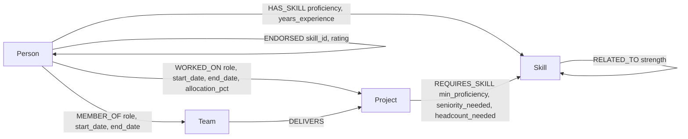

# Data Model

## Diagram

## Node labels

| Label | Key properties |
|---|---|
| `Person` | `id`, `name`, `email`, `title`, `seniority`, `location`, `timezone`, `weekly_capacity_hours`, `current_utilization_pct`, `available_from`, `hourly_cost` |
| `Skill` | `id`, `name`, `category` |
| `Project` | `id`, `name`, `client_name`, `status`, `start_date`, `end_date`, `budget`, `priority`, `description` |
| `Team` | `id`, `name`, `department` |

## Relationship types

| Relationship | Direction | Properties | Meaning |
|---|---|---|---|
| `HAS_SKILL` | `(Person)->(Skill)` | `proficiency` (1-5), `years_experience` | A person's asserted skill and strength |
| `RELATED_TO` | `(Skill)-(Skill)` | `strength` (0-1) | Skill-adjacency graph (e.g. Docker~Kubernetes) |
| `WORKED_ON` | `(Person)->(Project)` | `role`, `start_date`, `end_date`, `allocation_pct` | Project engagement history |
| `MEMBER_OF` | `(Person)->(Team)` | `role`, `start_date`, `end_date` | Team membership over time |
| `DELIVERS` | `(Team)->(Project)` | — | Which team owns a project |
| `REQUIRES_SKILL` | `(Project)->(Skill)` | `min_proficiency`, `seniority_needed`, `headcount_needed` | Project staffing requirement |
| `MANAGES` | `(Person)->(Person)` | — | Org hierarchy, arbitrary depth |
| `ENDORSED` | `(Person)->(Person)` | `skill_id`, `rating`, `note`, `date` | Peer endorsement of a specific skill |
